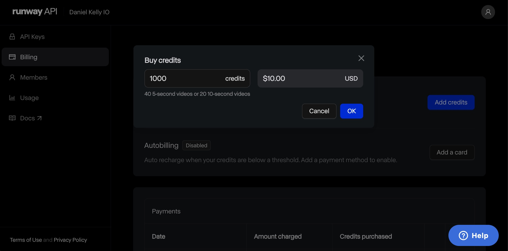
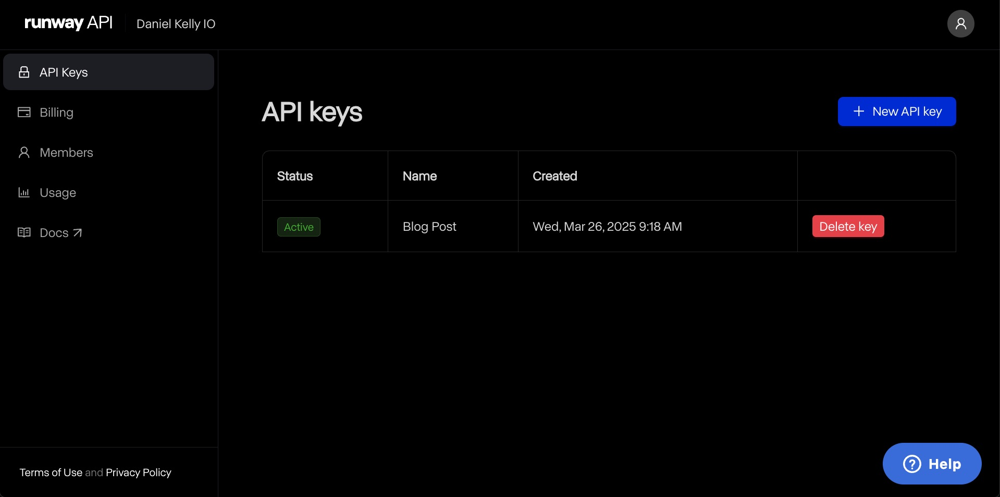
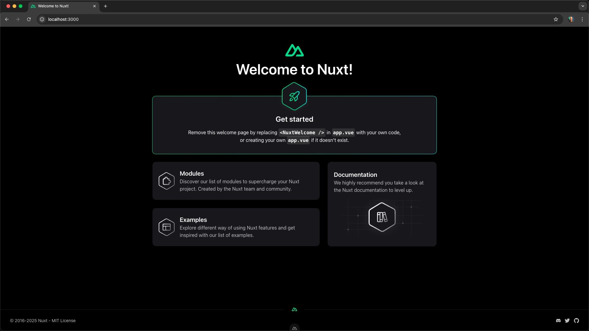

# Building an Avatar Video Generator with Nuxt.js and Runway

As I was thinking about a use-case for [Runway](https://runway.com) in a [Nuxt](https://nuxt.com) project, my mind wandered to the trading cards found in the Chocolate Frogs from Harry Potter. These magical treats came with collectible cards featuring famous witches and wizards that would actually move and interact with the viewer. While I can't promise any delicious chocolate with this project, I thought we could bring a touch of magic to a site component that hasn't changed in a long time: the avatar.

## How to Generate Videos from Images with AI

[Runway](https://runway.com) is a text-to-video and image-to-video AI service that has a simple to use REST API. You can try it out in their web app for free. It comes with 400 free credits per month (about 16 5 second video generations).

To start, we should upload an avatar image, construct a prompt, and see if we can generate a video that gives the effect that we're looking for.


The prompt that I ended up going with was this:
"A moving avatar that looks around subtly, blinks, looks forward, and seems to be looking at the camera, seemless loop, centered with space on either side"

The seamless loop didn't quite work out and because of the dimensions Runway supports, we had to crop the avatar. Alternately you could use something like Photoshop to generatively expand the image to 1280x768 from it's original square dimensions but the current result is still pretty cool.


## Integrating AI Video Generation into Nuxt

Generating the video in the web app is great for refining the prompt, and testing that Runway is a good fit for the project but the magic isn't quite as impressive this way. Imagine a user uploading an avatar image to YOUR APP, and then something completely unexpected happening. That's what we can accomplish with the API.

So let's get started.

### Create a Runway Developer Account

Runway has a seperate portal for developers. [You can create a developer account here.](https://dev.runwayml.com/). To make API calls, you'll need to buy credits. They start at $10 for 1000 credits (or about 40 5 second videos).



Next, you'll need to create an API Key for authenticating with the Runway API. I created one for this project and called it "Blog Post" but maybe a better name would have been "Avatar App API Key".



### Setup Runway in Nuxt

Now that the Runway API is ready, we'll need to setup the Nuxt project to use it.

First I'll create a new nuxt project and move into the directory.

```bash
npx nuxi init avatar-app
cd avatar-app
```

Then I'll install the Runway SDK.

```bash
npm install @vueuse/components @runwayml/sdk
```

Finally, let's add the Runway API key to the `.env` file and declare a runtime config variable for it in `nuxt.config.ts`.

```bash
# .env
NUXT_RUNWAY_API_KEY=your-api-key-here
```

```ts
// nuxt.config.ts
export default defineNuxtConfig({
  runtimeConfig: {
    runwayApiKey: "",
  },
});
```

### Create a Form for Uploading an Avatar Image

Start up the dev server with `npm run dev` and navigate to `http://localhost:3000`. You should see the Nuxt welcome screen.



Let's replace the welcome screen with a file input for uploading an avatar image.

```html
<template>
  <div>
    <input type="file" accept="image/png, image/jpeg" />
  </div>
</template>
```

### Create a Function to Upload the Avatar Image

Next, let's create a function to upload the avatar image to the Runway API. We don't want to interact with the Runway API directly from the browser because we'd expose our API key. Instead, we'll make a call to our own custom API endpoint to handle the upload.

```ts
// app.vue
const handleFileUpload = async (e: Event) => {
  // get the File object from the event
  const file = (e.target as HTMLInputElement).files?.[0];

  // make a POST request to the custom API endpoint we'll create in a moment
  const res = await $fetch("/api/movingAvatar/generate", {
    method: "POST",
    body: {
      url: // not sure what we'll send here yet
    },
  });
};
```

Then we should call it on the change event of the file input. The change event fires whenever the user selects a file from their file system.

```html
<input type="file" accept="image/png, image/jpeg" @change="handleFileUpload" />
```

### Base64 Encoding the Avatar Image

Selecting a file now runs the `handleFileUpload` function but it fails because we haven't defined the endpoint or provided the image data in the request.

Let's start by providing the image data. We could provide Runway with a public URL of an image but working on local this is a bit more difficult. Runway also accepts a base64 encoded image which isn't hard to generate from the `File` object. Let's go that route.

I'll create a helper function in the utils directory to convert the `File` object to a base64 string.

```ts
// utils/index.ts
export function blobToBase64(blob: Blob) {
  return new Promise<string>((resolve, reject) => {
    const fr = new FileReader();
    fr.onload = (e) => {
      resolve(e.target!.result as string);
    };
    fr.onerror = reject;
    fr.readAsDataURL(blob);
  });
}
```

Now we can use this function to convert the `File` object just before adding it to the request body.

```ts
const base64 = await blobToBase64(file);
const res = await $fetch("/api/movingAvatar/generate", {
  method: "POST",
  body: {
    url: base64,
  },
});
```

### Create the Nuxt API Endpoint to Talk to Runway

Things are moving along nicely but we're not quite there yet. Next let's create the API endpoint that will make the call to the Runway API.

In Nuxt we create these in the `server/api` directory.

```ts
// server/api/movingAvatar/generate.ts
export default defineEventHandler(async (e) => {});
```

The file structure determins the API route so the file above will run at `/api/movingAvatar/generate`.

Next we'll need to get the base64 encoded image from the request body. We sent it via a field called `url` so we can access it like this:

```ts
// server/api/movingAvatar/generate.ts
const body = await readBody(event);
const imageUrl = body?.url;
```

I called it `url` because it could be a valid publicly accessible URL or a base64 encoded string. If the url isn't provided we should throw an error.

```ts
// server/api/movingAvatar/generate.ts
if (!imageUrl) {
  throw createError({
    statusCode: 400,
    statusMessage: "No image URL or base64 encoded image provided",
  });
}
```

Next, we can pass the image along to Runway.

Let's create a helper function to always get the Runway client with the correct API key. We can create auto-imported helpers for API endpoints in the `server/utils` directory.

```ts
// server/utils/index.ts
export function useRunway() {
  // useRuntimeConfig gives access to all runtimeConfig variables
  // defined in nuxt.config.ts
  const { runwayApiKey } = useRuntimeConfig();
  return new Runway({ apiKey: runwayApiKey });
}
```

We'll then call the `useRunway` helper using the same prompt we used in the web app.

```ts
const runway = useRunway();

const imageToVideo = (await runway.imageToVideo.create({
  model: "gen3a_turbo",
  promptImage: imageUrl,
  promptText:
    "A moving avatar that looks around subtly, blinks, looks forward, and seems to be looking at the camera, seemless loop, centered with space on either side",
  duration: 5,
})) as generatedAvatar;
```

This kicks off a long running task. Let's get details about the task from the Runway API and return that to the browser.

```ts
// server/api/movingAvatar/generate.ts
const task = await runway.tasks.retrieve(imageToVideo.id);

return task;
```

BEFORE we return the task though, let's use the `event.waitUntil` method to run a function that polls the runway api for the task status until it's complete. `event.waitUntil` means we can return the response immediately (the pending task) but the server will keep running the `waitUntil` function in the background.

```ts
// server/api/movingAvatar/generate.ts
const task = await runway.tasks.retrieve(imageToVideo.id);

// call waitUntil BEFORE returning the task
event.waitUntil((async () => {})());

return task;
```

Inside this function we'll use the `runway` package to check the status of the video generation every second until it's either succeeded or failed.

```ts
event.waitUntil(
  (async () => {
    do {
      await sleep(1000);
      task = await runway.tasks.retrieve(imageToVideo.id);
      // do something with the task here no matter the status
    } while (!["SUCCEEDED", "FAILED"].includes(task.status));
  })()
);
```

Note that the sleep function here is a custom helper function that I've added to the utils directory to work with timeouts as promises.

```ts
// utils/index.ts
export function sleep(ms: number) {
  return new Promise((resolve) => setTimeout(resolve, ms));
}
```

As we're polling for the task status inside the do...while loop, we'll want to save the result to storage so we can:

1.  pass on that data to the client once the task is complete.
2.  have a persistent record of the video url

Nuxt's useStorage function is perfect for storing key value pairs. In development we can use the `data` storage bucket to store data directly in the file system. In production, you could configure your own storage bucket like AWS S3 or Cloudflare R2. Or you could use a database like SQLite or Postgres. Since KV storage is built into Nuxt, it's a great choice for this project.

We'll store the generated avatars using the id as the key.

```ts
// server/api/movingAvatar/generate.ts
const storage = useStorage("data");
storage.setItem(imageToVideo.id, task);
```

### Display the Avatar Video(s)

Now that we've saved the task to storage, we can display the avatar video(s) on the page.

```html
<!-- app.vue -->
<script setup lang="ts">
  const { data: avatars } = await useFetch("/api/movingAvatar");
</script>
```

On the client side, let's display the generated avatar video(s) in a list. First, we'll create another API endpoint to retrieve the avatars from storage and order them by the date they were created.

```ts
// server/api/movingAvatar/index.ts
import type { generatedAvatar } from "~/types";

export default defineEventHandler(async (event) => {
  const storage = useStorage("data");

  // get all the keys in the storage bucket
  const allKeys = await storage.getKeys();

  // get all the items in the storage bucket
  // in parallel based on the keys
  const allItems = await Promise.all(
    allKeys.map(async (key) => {
      return await storage.getItem<generatedAvatar>(key);
    })
  );

  // filter out any null items
  // and sort by the createdAt date
  return allItems
    .filter((item) => item !== null)
    .toSorted(
      (a, b) =>
        new Date(a!.createdAt).getTime() - new Date(b!.createdAt).getTime()
    ) as generatedAvatar[];
});
```

Now we can use this endpoint to display the avatar videos on the page.

```html
<script setup lang="ts">
  const { data: avatars } = await useFetch("/api/movingAvatar");
</script>

<template>
  <div>
    <ul>
      <li v-for="avatar in avatars" :key="avatar.id">
        <video
          :src="avatar.output.at(0)"
          v-if="avatar.status === 'SUCCEEDED'"
          width="150"
          height="150"
          style="object-fit: cover"
          muted
          autoplay
          loop
        />
        <div v-else-if="avatar.status === 'FAILED'">
          Failed to generate video
        </div>
        <div v-else>Pending...</div>
      </li>
    </ul>
  </div>
</template>
```

### Listen for Task Completion

We can also poll the avatars endpoint on the client side after a file is uploaded to display the video as soon as it's successfully saved to storage.

```ts
const { data: avatars, execute: fetchAvatars } = useFetch("/api/movingAvatar");

function handleFileUpload(e: Event) {
  // after the file is uploaded, refetch the avatars
  fetchAvatars();
}

// and then watch the avatars on an interval,
// when no more pending tasks, stop the interval
let interval: ReturnType<typeof setInterval> | undefined;
watch(
  avatars,
  () => {
    clearInterval(interval);
    const pending = avatars.value?.find(
      (avatar) =>
        ["PENDING", "RUNNING"].includes(avatar.status) || !avatar.status
    );
    if (pending) {
      interval = setInterval(fetchAvatars, 1000);
    }
  },
  {
    deep: true,
  }
);
</script>
```

### Conclusion

If you followed along with the steps above, you've complete the most important parts of building this app. Along the way we learned how to:

- [Upload an image as a base64 encoded string to the Runway API](https://docs.dev.runwayml.com/guides/quickstart/#uploading-base64-encoded-images-as-data-uris)
- Use the Runway API to generate videos from images
- [Create custom Nuxt API endpoints](https://vueschool.io/lessons/nuxt-server-api-routes)
- Store and retrieve data from Nuxt's KV storage
- Use the [`event.waitUntil` method to run a function in the background](https://nuxt.com/docs/guide/directory-structure/server#awaiting-promises-after-response)
- Poll our own API endpoint for task status updates
- Display the avatar video(s) on the page

All that's left to do now is style it to your liking! You could also add a preview of the avatar image before it's video is generated. You can see both of these added features in the [final code on GitHub](https://github.com/danielkellyio/runway-avatars).

Runway is a powerful tool for generating videos from images. When paired with Nuxt's server endpoints and storage, it's a great way to add some magic to your app. I hope you enjoyed this article and learned something new! If you want to learn more about handling file uploads in Nuxt and Vue then checkout our complete course on [File Uploads in Vue.js](https://vueschool.io/courses/file-uploads-in-vue-js).
